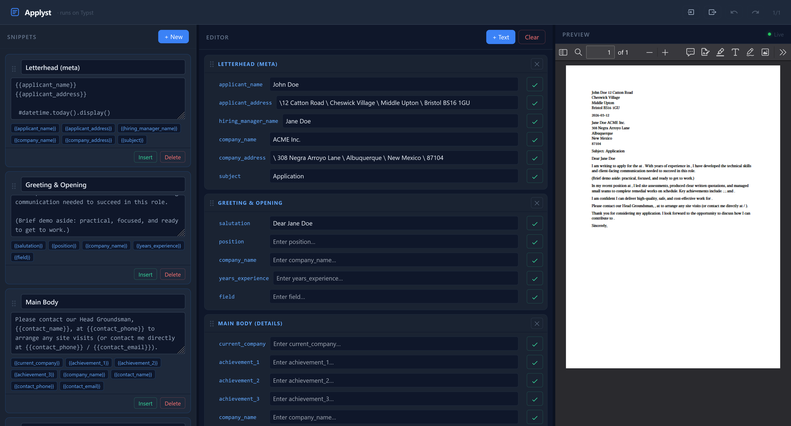

# Applyst

A small web app for assembling Typst-powered cover letters from reusable
snippets (but I guess you could use it for things that aren't cover letters).
Add content to the editor, fill variables, click "Apply" to bake values into
saved snippets, and get a live PDF preview, all fully in your browser; no login,
no server. To help you make repetitive work easier.



<details>
<summary>Demo File </summary>

[demo/demo.json](demo/demo.json)
```json
{
    "blocks": [
        {
            "id": "11111111-aaaa-4bbb-8ccc-000000000001",
            "title": "Letterhead (meta)",
            "content": "{{applicant_name}}\n{{applicant_address}}\n\n #datetime.today().display()\n\n{{hiring_manager_name}}\n{{company_name}}\n{{company_address}}\n\nSubject: {{subject}}\n"
        },
        {
            "id": "22222222-bbbb-4ccc-9ddd-000000000002",
            "title": "Greeting & Opening",
            "content": "{{salutation}}\n\nI am writing to apply for the {{position}} at {{company_name}}. With {{years_experience}} years of experience in {{field}}, I have developed the technical skills and client-facing communication needed to succeed in this role.\n\n(Brief demo aside: practical, focused, and ready to get to work.)\n"
        },
        {
            "id": "33333333-cccc-4ddd-8eee-000000000003",
            "title": "Main Body ",
            "content": "In my recent position at {{current_company}}, I led site assessments, produced clear written quotations, and managed small teams to complete remedial works on schedule. Key achievements include: {{achievement_1}}; {{achievement_2}}; and {{achievement_3}}.\n\nI am confident I can deliver high-quality, safe, and cost-effective work for {{company_name}}.\n\nPlease contact our Head Groundsman, {{contact_name}}, at {{contact_phone}} to arrange any site visits (or contact me directly at {{contact_phone}} / {{contact_email}}).\n"
        },
        {
            "id": "44444444-dddd-4eee-9fff-000000000004",
            "title": "Closing & Signatures",
            "content": "{{closing}}\n\nThank you for considering my application. I look forward to the opportunity to discuss how I can contribute to {{company_name}}.\n\nSincerely,\n\n{{applicant_name}}\n{{contact_phone}}\n{{contact_email}}\n"
        }
    ],
    "nodes": [
        {
            "id": "019ce29e-b9ac-778c-bf25-3d0881506d65",
            "type": "snippet",
            "title": "Letterhead (meta)",
            "template": "{{applicant_name}}\n{{applicant_address}}\n\n #datetime.today().display()\n\n{{hiring_manager_name}}\n{{company_name}}\n{{company_address}}\n\nSubject: {{subject}}\n",
            "vars": {
                "applicant_name": "John Doe",
                "applicant_address": "\\12 Catton Road \\ Cheswick Village \\ Middle Upton \\ Bristol BS16 1GU",
                "hiring_manager_name": "Jane Doe",
                "company_name": "ACME Inc.",
                "company_address": "\\ 308 Negra Arroyo Lane \\ Albuquerque \\ New Mexico \\ 87104",
                "subject": "Application"
            },
            "blockId": "11111111-aaaa-4bbb-8ccc-000000000001"
        },
        {
            "id": "019ce29e-c54e-7583-bf49-d9f33cca9ff2",
            "type": "snippet",
            "title": "Greeting & Opening",
            "template": "{{salutation}}\n\nI am writing to apply for the {{position}} at {{company_name}}. With {{years_experience}} years of experience in {{field}}, I have developed the technical skills and client-facing communication needed to succeed in this role.\n\n(Brief demo aside: practical, focused, and ready to get to work.)\n",
            "vars": {
                "salutation": "Dear Jane Doe",
                "position": "",
                "company_name": "",
                "years_experience": "",
                "field": ""
            },
            "blockId": "22222222-bbbb-4ccc-9ddd-000000000002"
        },
        {
            "id": "019ce29e-cc7a-712e-aae0-200e754300b6",
            "type": "snippet",
            "title": "Main Body (details)",
            "template": "In my recent position at {{current_company}}, I led site assessments, produced clear written quotations, and managed small teams to complete remedial works on schedule. Key achievements include: {{achievement_1}}; {{achievement_2}}; and {{achievement_3}}.\n\nI am confident I can deliver high-quality, safe, and cost-effective work for {{company_name}}.\n\nPlease contact our Head Groundsman, {{contact_name}}, at {{contact_phone}} to arrange any site visits (or contact me directly at {{contact_phone}} / {{contact_email}}).\n",
            "vars": {
                "current_company": "",
                "achievement_1": "",
                "achievement_2": "",
                "achievement_3": "",
                "company_name": "",
                "contact_name": "",
                "contact_phone": "",
                "contact_email": ""
            },
            "blockId": "33333333-cccc-4ddd-8eee-000000000003"
        },
        {
            "id": "019ce29e-daf9-72cd-ae4c-562ce5fb90a2",
            "type": "snippet",
            "title": "Closing & Signatures",
            "template": "{{closing}}\n\nThank you for considering my application. I look forward to the opportunity to discuss how I can contribute to {{company_name}}.\n\nSincerely,\n\n{{applicant_name}}\n{{contact_phone}}\n{{contact_email}}\n",
            "vars": {
                "closing": "",
                "company_name": "",
                "applicant_name": "",
                "contact_phone": "",
                "contact_email": ""
            },
            "blockId": "44444444-dddd-4eee-9fff-000000000004"
        }
    ],
    "sizes": {
        "left": 25,
        "middle": 45,
        "right": 30
    }
}
```

</details>

## Stack

Solid.js, Typst (renderer + WASM compiler), UnoCSS, Vite

## Run locally

```bash
pnpm install
pnpm dev
```
